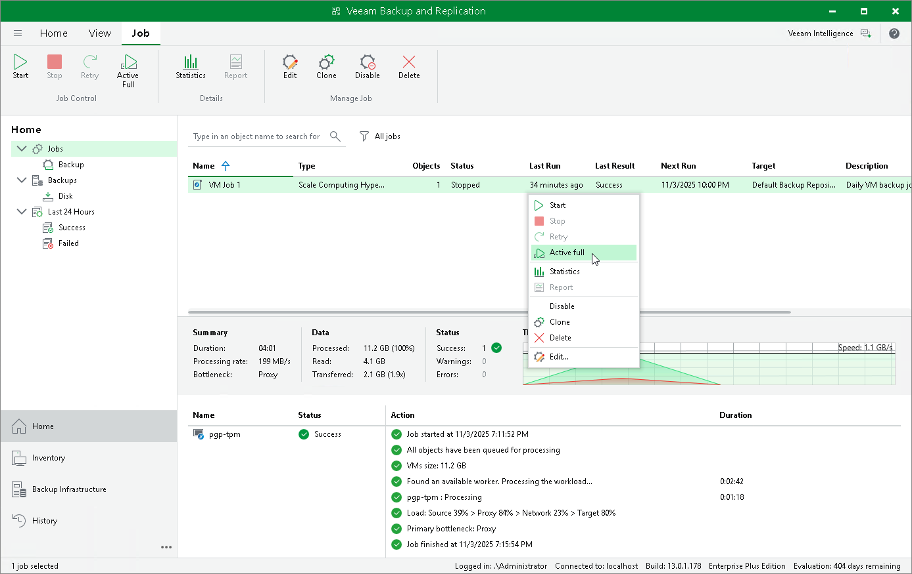

# Creating Active Full Backups

You can manually create an [active full backup](active_full_backup.md) for all VMs added to a backup job:

1. Open the Home view.
2. In the inventory pane, select Jobs.
3. In the working area, select the necessary job and click Active Full on the ribbon.

Alternatively, right-click the job and select Active full.

|  |
| --- |
| Tip |
| To create active full backup automatically according to a specific schedule, configure backup job settings as described in section [Creating Backup Jobs](backup_job_create_advanced.md) (step 4). |

