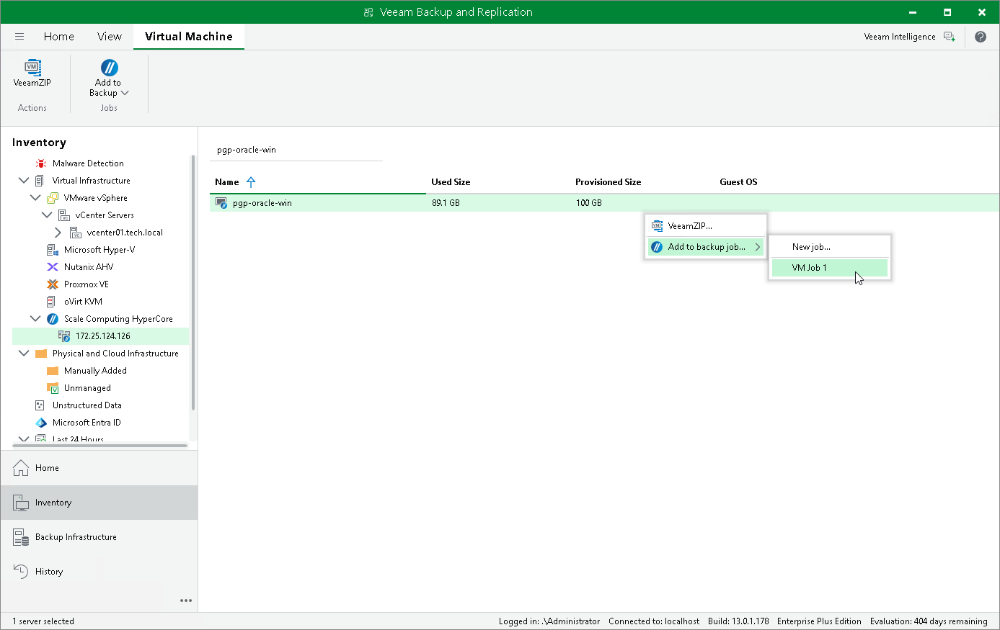

# Adding VMs to Backup Job

You can add Scale Computing HyperCore VMs to a new or existing backup job:

1. Open the Inventory view.
2. In the inventory pane, select Virtual Infrastructure > Scale Computing HyperCore.
3. In the working area, select the VM that you want to back up and click Add to Backup on the ribbon.

Alternatively, right-click the VM and select Add to backup job.

1. To create a new job, select New job and configure a new job as described in the [Creating Backup Jobs](backup_job_create.md) section.

To add a VM to an existing job, select the job from the list.

