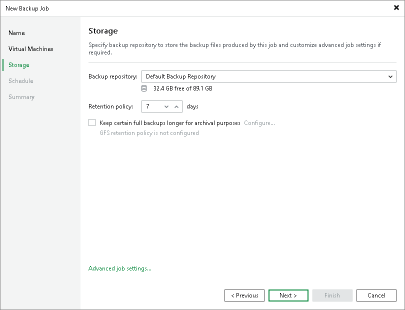

# Step 4. Specify Backup Job Settings

At the Storage step of the wizard, do the following:

1. In the Backup repository drop-down list, select a backup repository where you want to store backups.

For a backup repository to be displayed in the list of available repositories, it must be [added to the backup infrastructure](configure_repository.md).

|  |
| --- |
| Important |
| If a repository storing Scale Computing HyperCore backups becomes an extent of a scale-out backup repository, the jobs targeting that repository will fail. You can edit the job to target a scale-out backup repository to fix the problem. |

1. In the Retention policy section, specify the number of days during which you want to keep restore points in a backup chain. If a restore point is older than the specified limit, Veeam Plug-in for Scale Computing HyperCore removes it from the chain.

If the UUID of a VM changes (for example, if the VM was imported or cloned), Veeam Plug-in for Scale Computing HyperCore will be unable to continue the backup chain for this VM. After you re-add the VM to the backup job, Veeam Plug-in for Scale Computing HyperCore will start a new backup chain for it. However, you will still be able to perform restore operations using backups from the old backup chain.

To help you implement a comprehensive backup strategy, Veeam Plug-in for Scale Computing HyperCore allows you to [enable long-term retention policy for backups](backup_job_create_gfs.md) and to [configure backup job advanced settings](backup_job_create_advanced.md) (such as backup maintenance, health check, active and synthetic full backups).

