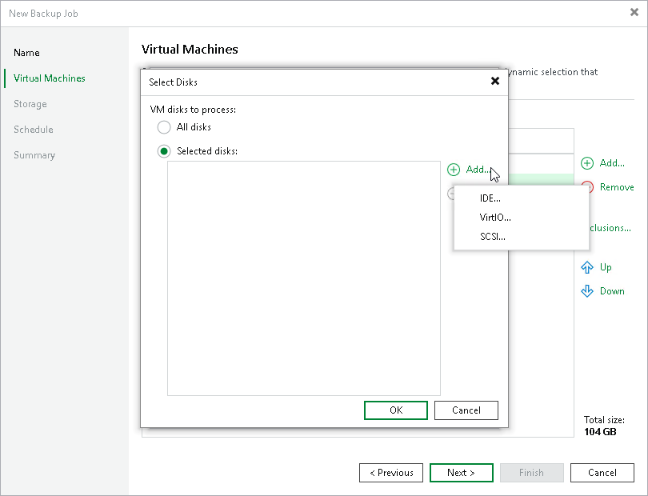

# Step 3b. Choose Disks

Second, at the Virtual Machines step of the wizard, you can instruct Veeam Plug-in for Scale Computing HyperCore to back up only specific virtual disks related to the selected backup scope:

1. Click Exclusions.
2. In the Exclusions window, switch to the Disks tab and click Add.
3. In the Add Objects window, select a resource that you have added to the backup scope at [step 3a](backup_job_create_resources.md), and click OK.
4. Back to the Exclusions window, select the resource and click Edit.
5. In the Select Disks window, select the Selected Disks option, click Add and choose a bus type of the disks that you want to back up. Then, select the necessary disks.

Disks that you do not select will be excluded from the backup job.

