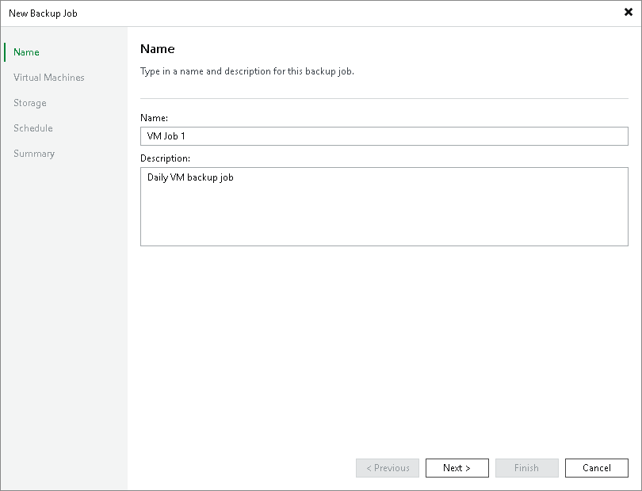

# Step 2. Specify Job Name and Description

At the Name step of the wizard, use the Name and Description fields to specify a name for the new backup job and to provide a description for future reference. The job name must be unique in Veeam Plug-in for Scale Computing HyperCore.

The maximum length of the name is 40 characters; the following characters are not supported: ~ " # % & \* : < > ! ? / \ { | } . ' ` $. The maximum length of the description is 1024 characters.

