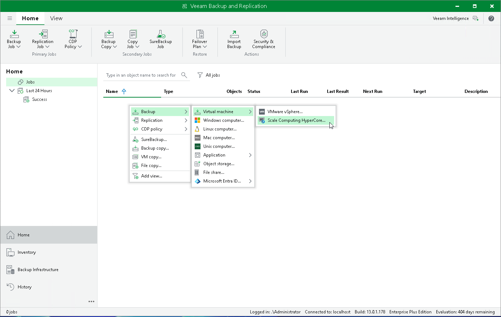

# Step 1. Launch New Backup Job Wizard

To launch the New Job wizard, do the following:

1. Open the Home view.
2. In the inventory pane, select Jobs.
3. On the ribbon, click Backup Job and select Virtual Machine > Scale Computing HyperCore.

Alternatively, right-click the working area and select Backup > Virtual machine > Scale Computing HyperCore.

