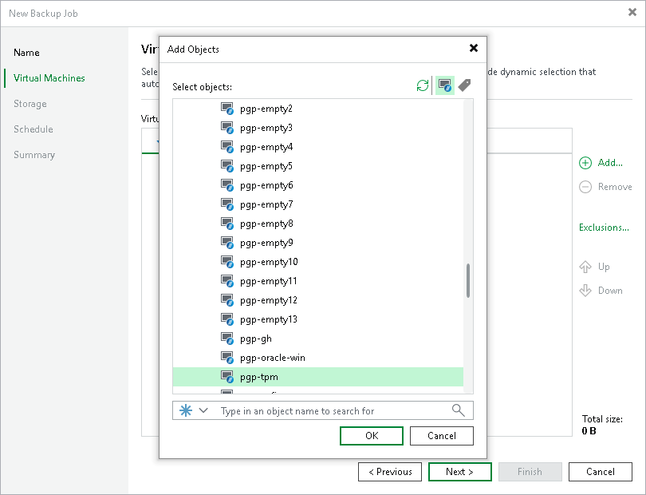

# Step 3a. Choose Resources

First, at the Virtual Machines step of the wizard, specify the backup scope — resources that Veeam Plug-in for Scale Computing HyperCore will back up:

1. Click Add.
2. In the Add Objects window, choose whether you want to back up all VMs in the cluster, only specific VMs or groups of VMs included into VM tags:

To view the list of available VM tags, click the VMs and Tags icon on the toolbar at the top right corner of the window. If you add a VM tag to the backup scope, Veeam Plug-in for Scale Computing HyperCore will regularly check for new VMs included into the added tag and automatically update the backup job settings to include these VMs in the scope. For a VM tag to be displayed in the list, it must be configured in the Scale Computing HyperCore administration portal and must contain at least one VM.

|  |
| --- |
| Tip |
| As an alternative to specifying resources explicitly, you can exclude a number of resources from the backup scope. To do that, click Exclusions and specify the VMs that you do not want to back up — the procedure is the same as described for including resources in the backup scope.  Consider that if a resource appears both in the list of included and excluded resources, Veeam Plug-in for Scale Computing HyperCore will still not process the resource because the list of excluded resources has a higher priority. |

While running the job, Veeam Plug-in for Scale Computing HyperCore processes resources in the order they are added to the backup scope. However, you can change the order, for example, if you add some mission-critical VMs to the job and want them to be processed first. To change the processing order, select a resource and use the Up or Down buttons.

|  |
| --- |
| Note |
| Consider the following:   * If you include the same resource into the backup scope multiple times (for example, an individual VM and a tag that contains this VM), Veeam Plug-in for Scale Computing HyperCore will process this resource only once.  * If you include a cluster or tag into the backup scope, VMs in this object are processed at random. To ensure that the VMs are processed in a specific order, you must add them as standalone VMs — not as part of the cluster or tag. |

By default, jobs process all disks attached to VMs included into the backup scope. However, you can protect only specific disks of the selected resources. For more information, see [Step 3b. Choose Disks and Volume Groups](backup_job_create_disk_excludes.md).

