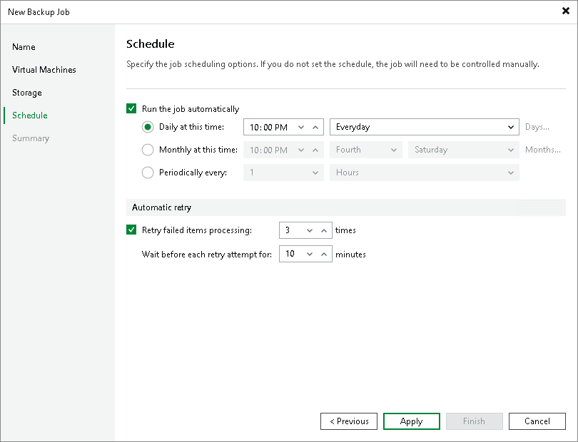

# Step 5. Define Job Schedule

At the Schedule step of the wizard, you can instruct Veeam Plug-in for Scale Computing HyperCore to start the backup job automatically according to a specific backup schedule. The backup schedule defines how often data of the VMs added to the backup job will be backed up.

Veeam Plug-in for Scale Computing HyperCore allows you to create schedules of the following types:

* Daily at this time — the backup job will create restore points at a specific time on specific days.
* Monthly at this time — the backup job will create restore points once a month on a specific day.
* Periodically every — the backup job will create restore points repeatedly with a specific time interval every day.

|  |
| --- |
| Tip |
| You can instruct Veeam Plug-in for Scale Computing HyperCore to run the backup job again if it fails on the first try. To do that, select the Retry failed items processing check box, and specify the maximum number of attempts to run the backup job and the time interval between retries. When retrying backup jobs, Veeam Plug-in for Scale Computing HyperCore processes only those VMs that failed to be backed up during the previous attempt. |

