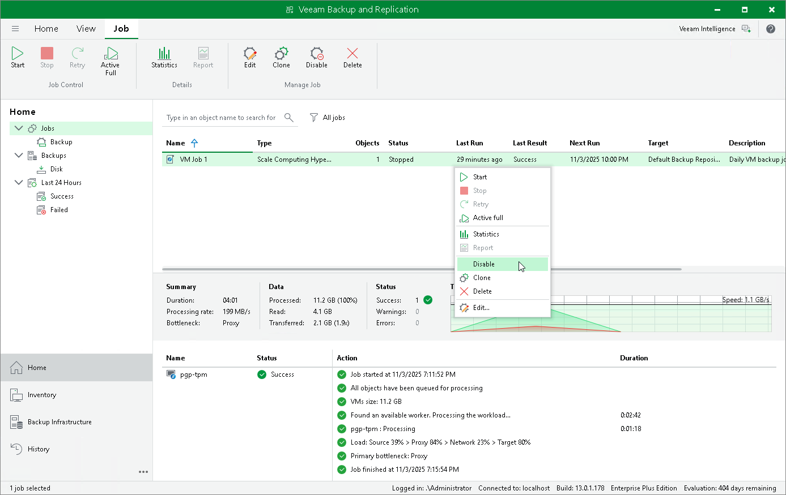

# Enabling and Disabling Backup Jobs

By default, all created backup jobs run according to the specified schedules. However, you can temporarily disable a job so that it does not run automatically. You will still be able to enable the disabled job at any time you need.

To enable or disable a backup job, do the following:

1. Open the Home view.
2. In the inventory pane, select Jobs.
3. In the working area, select the necessary job and click Enable or Disable on the ribbon.

Alternatively, right-click the job and select Enable or Disable.

