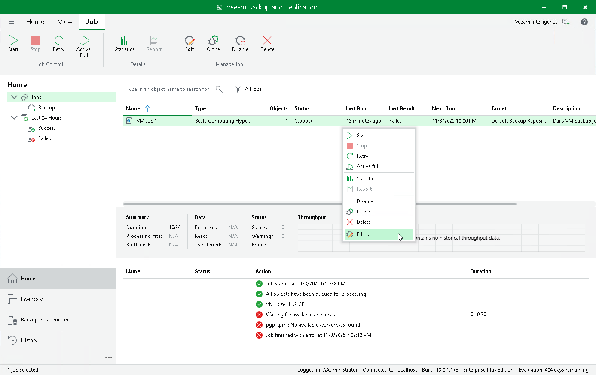

# Editing Backup Job Settings

For each backup job, you can modify settings configured while creating the job.

1. Open the Home view.
2. In the inventory pane, select Jobs.
3. In the working area, select the necessary job and click Edit on the ribbon.

Alternatively, right-click the job and select Edit.

1. Complete the Edit Job wizard:

1. To provide a new name and description for the job, follow the instructions provided in the [Step 2. Specify Job Name and Description](backup_job_create_general_settings.md) section.
2. To edit the backup scope, follow the instructions provided in the [Step 3. Configure Backup Source Settings](backup_job_create_assign_vms.md) section.
3. To change the backup repository where backups are stored, to configure backup job retention settings, to schedule active and synthetic full backups, to configure health checks and email notifications, follow the instructions provided in the [Step 4. Specify Backup Job Settings](backup_job_create_destination.md) section.
4. To modify the job schedule and configure automatic retry settings, follow the instructions provided in the [Step 5. Define Job Schedule](backup_job_create_schedule.md) section.
5. At the Summary step of the wizard, review configuration information and click Finish.

