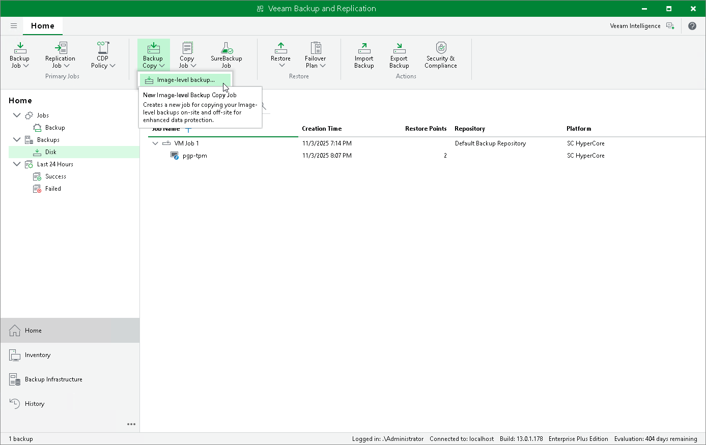

# Copying Backups

With backup copy, you can create several instances of a backup and copy them to secondary (target) backup repositories for long-term storage. Target backup repositories can be located in the same site as the source backup repository or can be deployed off-site. Since the backup copy has the same format as the original backup, you can restore VM data directly from the backup copy in case a disaster strikes. For more information on the backup copy functionality, see the Veeam Backup & Replication User Guide, section [Backup Copy](https://helpcenter.veeam.com/docs/vbr/userguide/backup_copy.html?ver=13).

To copy backups to a secondary backup repository, do the following:

1. Open the Home view.
2. In the inventory pane, select Jobs > Backup and click Backup Copy > Image-level backup on the ribbon.
3. Create a backup copy job as described in the Veeam Backup & Replication User Guide, section [Creating Backup Copy Jobs](https://helpcenter.veeam.com/docs/vbr/userguide/backup_copy_create.html?ver=13).

Note that for backup copies, you can also use Veeam Cloud Connect repositories if a service provider is added to Veeam Backup & Replication.

|  |
| --- |
| Tip |
| Alternatively, you can create a copy of a backup without configuring a job as described in the Veeam Backup & Replication User Guide, section [Copying Backups](https://helpcenter.veeam.com/docs/vbr/userguide/copy_backup.html?ver=13). |

