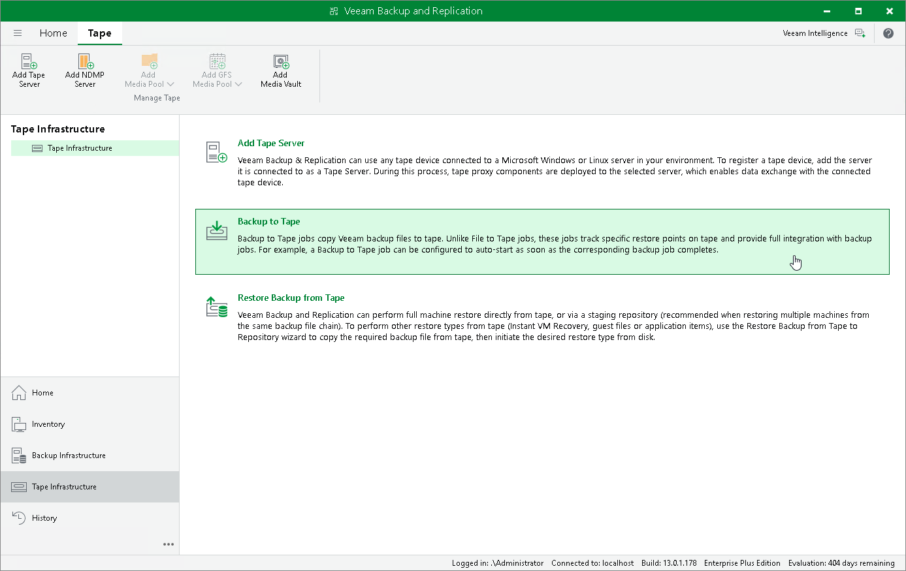

# Copying Backups to Tapes

You can create archives of VM backups and copy them to tapes for long-term storage. Veeam Plug-in for Scale Computing HyperCore allows you to manage tape archives the same way you manage backups in backup repositories. However, it usually takes more time to access archived data on tapes than to access backed-up data in repositories. For more information on tapes, see the Veeam Backup & Replication User Guide, section [Tape Devices Support](https://helpcenter.veeam.com/docs/vbr/userguide/tape_device_support.html?ver=13).

To archive VM backups to tape, do the following:

1. Configure the tape infrastructure:

1. Connect tape devices as described in the Veeam Backup & Replication User Guide, section [Tape Devices Deployment](https://helpcenter.veeam.com/docs/vbr/userguide/tape_deployment.html?ver=13).
2. Perform initial configuration of the tape infrastructure as described in the Veeam Backup & Replication User Guide, section [Getting Started with Tapes](https://helpcenter.veeam.com/docs/vbr/userguide/getting_started_with_tapes.html?ver=13) (steps 1–3).

1. Create a backup to tape job as described in the Veeam Backup & Replication User Guide, section [Creating Backup to Tape Jobs](https://helpcenter.veeam.com/docs/vbr/userguide/creating_backup_to_tape_jobs.html?ver=13).

|  |
| --- |
| Note |
| You cannot restore Scale Computing HyperCore VMs directly from tapes. To restore an Scale Computing HyperCore VM, you must first restore its backups to a repository as described in the Veeam Backup & Replication User Guide, section [Backup Restore from Tape to Repository](https://helpcenter.veeam.com/docs/vbr/userguide/vm_restore_from_tape_to_repository.html?ver=13). |

