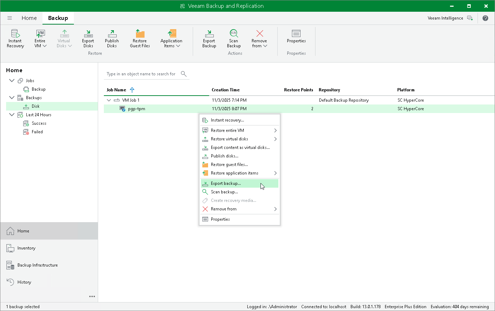

# Exporting Backups

Exporting backups allows you to synthesize a complete and independent full backup file using restore points located in your backup repositories. That is, you can transform any backup chain into a standalone full backup file and save it to a repository or folder.

To export a backup, do the following:

1. Open the Home view.
2. In the inventory pane, select Backups.
3. In the working area, expand the job that created the backup, right-click the VM for which you want to synthesize a full backup file, and select Export Backup.

Alternatively, expand the necessary backup job, select the VM and click Export Backup on the ribbon.

1. Complete the New Export wizard as described in the Veeam Backup & Replication User Guide, section [Performing Export](https://helpcenter.veeam.com/docs/vbr/userguide/performing_full_export.html?ver=13).

Once the export operation completes, the exported backup will be displayed under the Backups > Disk (Exported) node in the Home view of the Veeam Backup & Replication console.

