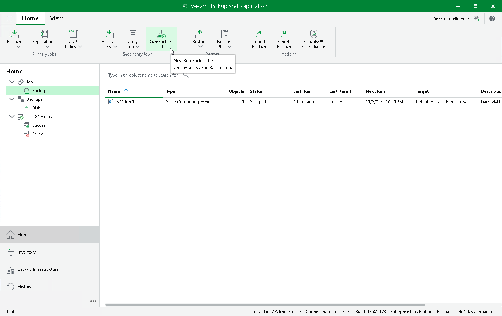

# Verifying Backups

To perform an integrity check of VM backups, Veeam Backup & Replication offers the SureBackup technology that allows you to ensure that the created restore points are not corrupted. For backups of Windows VMs, you can also scan the restore points with antivirus software installed on the backup server, and run YARA rules to detect malware and sensitive data.

To create a SureBackup job, do the following:

1. Open the Home view.
2. In the inventory pane, select Jobs > Backup and click SureBackup Job on the ribbon.
3. At the Name step of the New SureBackup Job wizard, select the Backup verification and content scan only verification mode, and then complete the wizard as described in the Veeam Backup & Replication User Guide, section [Creating SureBackup Jobs](https://helpcenter.veeam.com/docs/vbr/userguide/create_surebackup_job.html?ver=13).

If any of the verification checks fail for a restore point, Veeam Backup & Replication will mark both this restore point and all subsequent points in the backup chain as Infected. To learn how to manage infected restore points, see Veeam Backup & Replication User Guide, section [Managing Malware Status](https://helpcenter.veeam.com/docs/vbr/userguide/malware_detection_managing_status.html?ver=13).

|  |
| --- |
| Tip |
| You can scan backups of Windows VMs manually on demand, without creating a SureBackup job. To learn how to do that, see the Veeam Backup & Replication User Guide, section [Scan Backup](https://helpcenter.veeam.com/docs/vbr/userguide/malware_detection_scan_backup.html?ver=13). |

