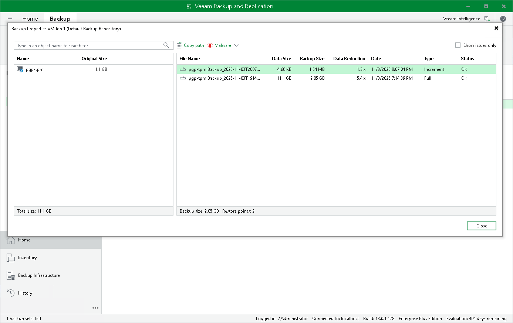

# Viewing Backup Properties

After a backup job successfully creates a VM backup according to the specified schedule, or after you create an active full VM backup manually, the backup is displayed under the Backups node in the Home view of the Veeam Backup & Replication console. Each backup is represented with a set of properties, such as:

* Name — the name of a protected VM.
* Original Size — the total amount of disk space allocated to the VM.
* File Name — the name of a restore point.
* Data Size — the amount of processed VM data.
* Backup Size — the amount of backed-up VM data.
* Data Reduction — the ratio between the data size and backup size.
* Date — the date and time when the restore point was created.
* Immutable Until — the date when the immutability period for the restore point will expire.
* Status — the result of the most recent malware scan performed for the restore point.

To view backup properties, do the following:

1. Open the Home view.
2. In the inventory pane, select Backups.
3. In the working area, right-click the necessary backup job and select Properties.

