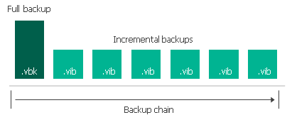
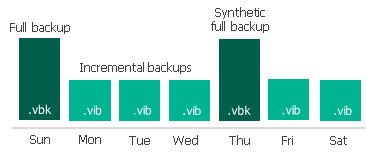

# Forward Incremental Backup

To create a backup chain for a VM protected by a backup job that is configured to produce full backups, Veeam Plug-in for Scale Computing HyperCore implements the forward incremental backup method:

1. During the first (full) backup session, Veeam Plug-in for Scale Computing HyperCore copies the full VM image and creates a full backup file in the backup repository. The full backup file becomes a starting point in the backup chain.
2. During subsequent backup sessions, Veeam Plug-in for Scale Computing HyperCore copies only those data blocks that have changed since the previous backup session, and stores these data blocks to incremental backup files in the backup repository. The content of each incremental backup file depends on the content of the full backup file and the preceding incremental backup files in the backup chain.

1. On a day when the [synthetic full](synthetic_full_backup.md) or [active full](active_full_backup.md) backup is scheduled, Veeam Plug-in for Scale Computing HyperCore creates a full backup file and adds it to the backup chain. Incremental restore points produced after this full backup file use it as a new starting point.

