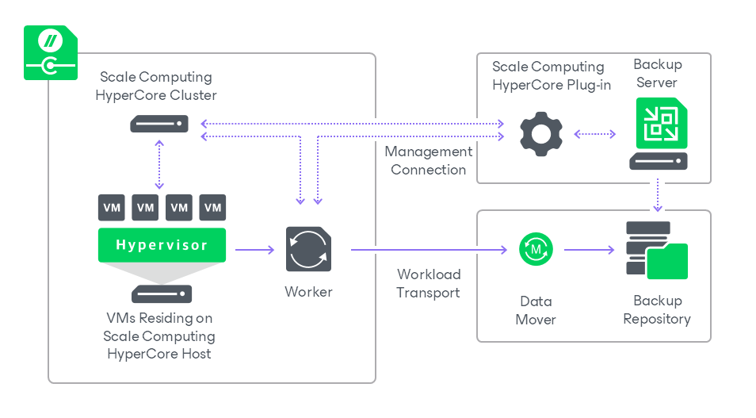

# Solution Architecture

The Veeam Plug-in for Scale Computing HyperCore architecture comprises the following set of components:

* [Scale Computing HyperCore cluster](#cluster)
* [Backup server](#server)
* [Plug-in](#plugin)
* [Backup repositories](#repositories)
* [Workers](#workers)

Scale Computing HyperCore Cluster

A Scale Computing HyperCore cluster is a cluster node containing one or more servers that run the Scale Computing HyperCore software. Veeam Plug-in for Scale Computing HyperCore uses the server to access such Scale Computing HyperCore resources as storage, networks and VMs while performing backup and restore operations.

Backup Server

A backup server is a Windows-based physical or virtual machine on which Veeam Backup & Replication is installed. The backup server is the configuration, administration and management core of the backup infrastructure. It coordinates backup and restore operations, controls job scheduling and manages resource allocation.

Plug-in

Plug-in enables integration between the backup server and the Scale Computing HyperCore cluster. Plug-in also allows the backup server to deploy and manage workers.

Backup Repositories

A backup repository is a storage location where Veeam Plug-in for Scale Computing HyperCore stores backups of protected Scale Computing HyperCore VMs.

To communicate with backup repositories, Veeam Plug-in for Scale Computing HyperCore uses Veeam Data Mover — the service that is responsible for data processing and transfer. By default, Veeam Data Mover runs on the repositories themselves. If a repository cannot host Veeam Data Mover, it starts on a gateway server — a dedicated component that “bridges” the backup server and workers. For more information, see the Veeam Backup & Replication User Guide, section [Gateway Server](https://helpcenter.veeam.com/docs/vbr/userguide/gateway_server.html?ver=13).

Workers

A worker is a Linux-based VM that resides on the Scale Computing HyperCore host and processes backup workloads when transferring data to and from backup repositories.

