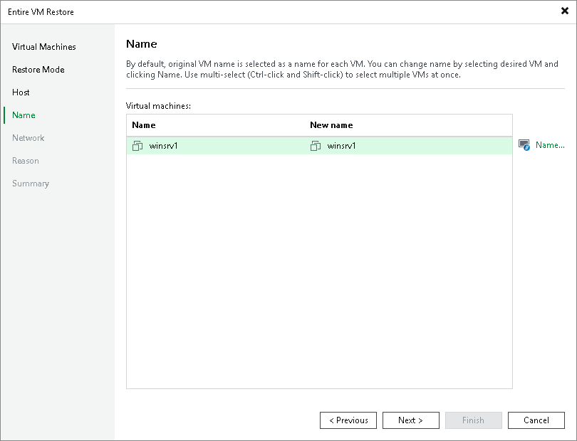

# Step 5. Specify VM Name

[This step applies only if you have selected the Restore to a new location, or with different settings option at the Restore Mode step of the wizard]

At the Name step of the wizard, you can specify a new name for the recovered VM. The maximum length of the name is 48 characters; only the following characters are supported: a-z, A-Z, 0-9, hyphen-minus character (-), underscore character (\_).

