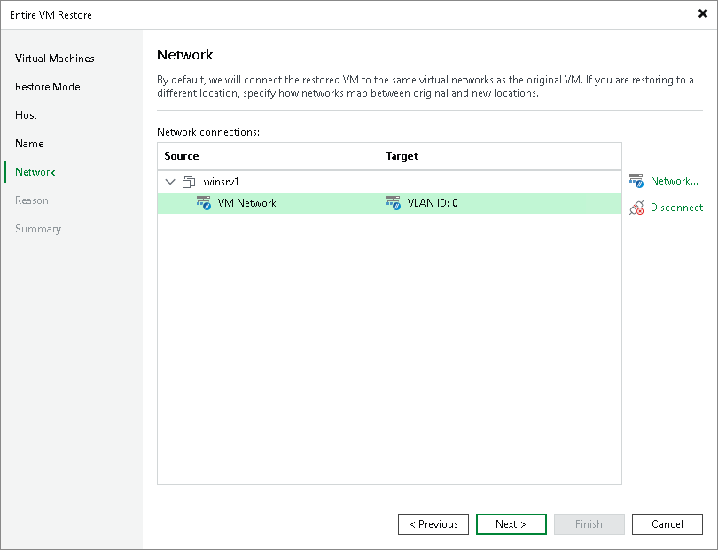

# Step 6. Configure Network Settings

[This step applies only if you have selected the Restore to a new location, or with different settings option at the Restore Mode step of the wizard]

At the Network step of the wizard, choose a network to which the recovered VM will be connected.

To see the list of available networks, select the VM or a network and click Network. If you do not want to connect the VM to any virtual network, select the VM or suggested network and click Disconnect.

