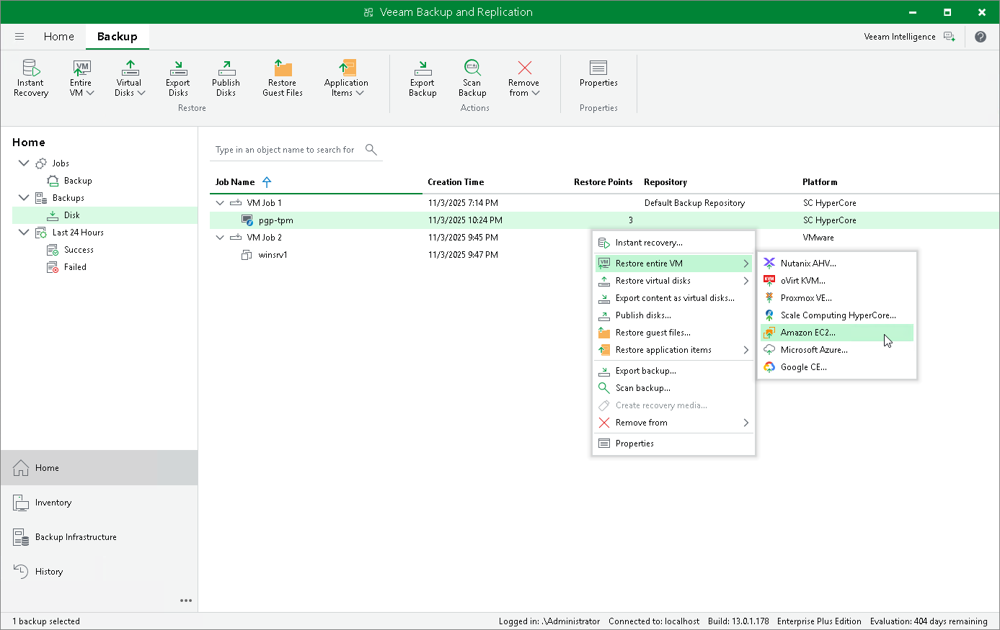

# Performing VM Restore to Amazon Web Services

Veeam Plug-in for Scale Computing HyperCore allows you to restore Scale Computing HyperCore VMs to Amazon Web Services (AWS) as EC2 instances. For more information, see the Veeam Backup & Replication User Guide, section [Restore to Amazon EC2](https://helpcenter.veeam.com/docs/vbr/userguide/restore_amazon.html?ver=13).

To restore a VM to Amazon EC2, do the following:

1. Open the Home view.
2. In the inventory pane, select Backups.
3. In the working area, expand the necessary backup job, right-click the VM that you want to restore and select Restore to Amazon EC2.
4. Complete the Restore to Amazon EC2 wizard as described in the Veeam Backup & Replication User Guide, section [Restoring to Amazon EC2](https://helpcenter.veeam.com/docs/vbr/userguide/restore_amazon_process.html?ver=13).

