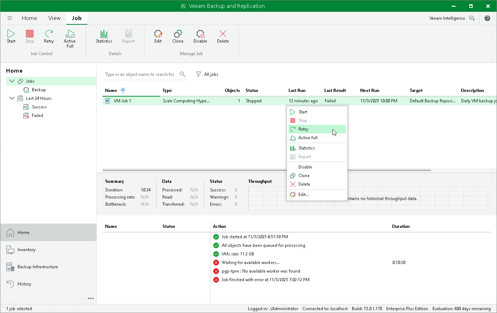

# Retrying Jobs

If a job fails, you can retry the backup operation. When you perform a retry, Veeam Plug-in for Scale Computing HyperCore restarts the operation only for the failed resources added to the job and does not process VMs that have been processed successfully. As a result, in cases when only a part of source objects remain unprotected, retrying a job takes less time compared to restarting the job for all resources.

To retry a job, do the following:

1. Open the Home view.
2. In the inventory pane, select Jobs.
3. In the working area, select the necessary job and click Retry on the ribbon.

Alternatively, right-click the job and select Retry.

