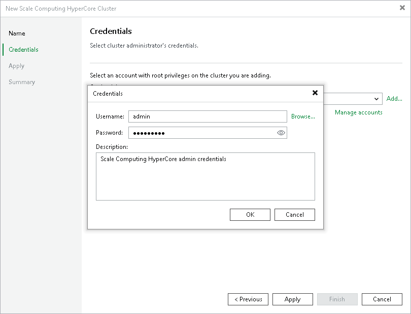

# Step 3. Enter Credentials

At the Credentials step of the wizard, specify credentials of an account that will be used to access the Scale Computing HyperCore cluster.

For credentials to be displayed in the Credentials list, they must be added to the Credentials Manager as described in the Veeam Backup & Replication User Guide, section [Standard Accounts](https://helpcenter.veeam.com/docs/backup/vsphere/credentials_manager_windows.html?ver=120). If you have not added the necessary credentials to the Credentials Manager beforehand, you can do this without closing the New Scale Computing HyperCore Cluster wizard. To do that, click either the Manage accounts link or the Add button, and specify the user name, password and description in the Credentials window.

After you click Apply, the backup server will connect to the Scale Computing HyperCore cluster and check its TLS certificate. If the certificate is not installed on the backup server, the Certificate Security Alert Window will display a warning notifying that secure communication cannot be guaranteed. To allow the backup server to connect to the Scale Computing HyperCore cluster using the certificate, click Continue.

