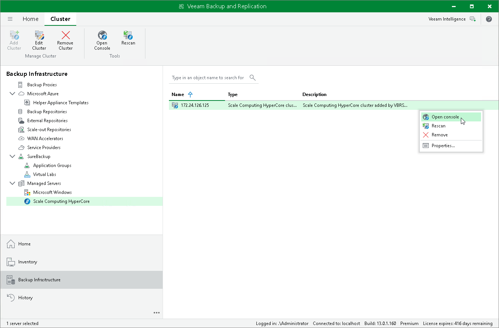

# Accessing Scale Computing HyperCore Cluster Console

If you want to check the configuration of your Scale Computing HyperCore infrastructure, you can use Veeam Plug-in for Scale Computing HyperCore to launch the Scale Computing HyperCore console.

To access the Scale Computing HyperCore console:

1. Open the Backup Infrastructure view.
2. In the inventory pane, select Managed Servers > Scale Computing HyperCore.
3. In the working area, select the necessary cluster and click Open Console on the ribbon.

Alternatively, right-click the cluster and select Open console.

