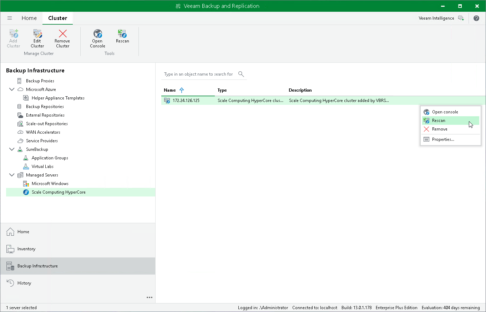

# Rescanning Scale Computing HyperCore Cluster

Veeam Plug-in for Scale Computing HyperCore retrieves information about the Scale Computing HyperCore environment from the Scale Computing HyperCore cluster. However, the data synchronization process may take some time to complete. If you make any changes to the Scale Computing HyperCore environment and want the Veeam Backup & Replication console to display the changes immediately, you can rescan the Scale Computing HyperCore cluster manually.

To rescan the Scale Computing HyperCore cluster, do the following:

1. Open the Backup Infrastructure view.
2. In the inventory pane, select Managed Servers > Scale Computing HyperCore.
3. In the working area, select the necessary cluster and click Rescan on the ribbon.

Alternatively, right-click the cluster and select Rescan.

