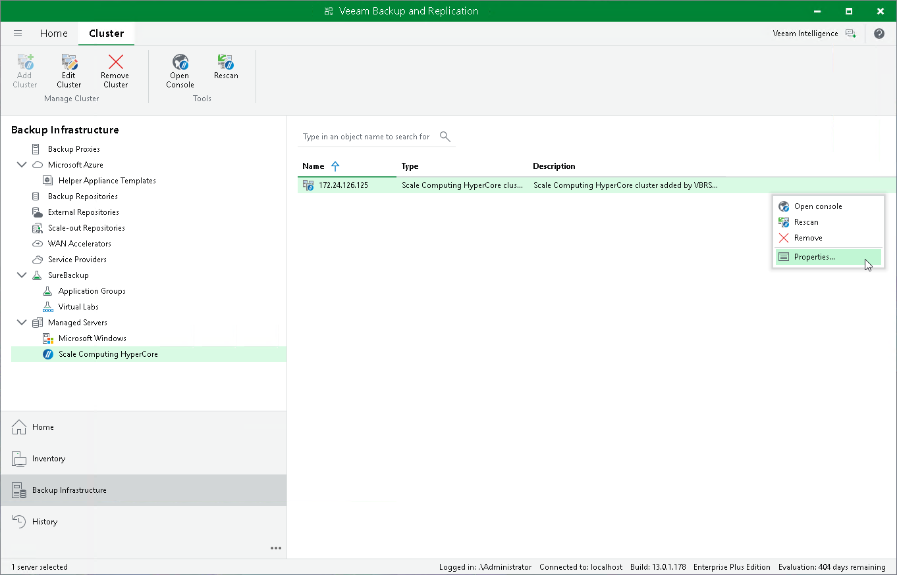

# Editing Scale Computing HyperCore Cluster Properties

To edit properties of the Scale Computing HyperCore cluster added to the backup infrastructure, do the following:

1. Open the Backup Infrastructure view.
2. In the inventory pane, select Managed Servers > Scale Computing HyperCore.
3. In the working area, select the necessary cluster and click Edit Cluster on the ribbon.

Alternatively, right-click the cluster and select Properties.

1. Complete the Edit Scale Computing HyperCore Cluster wizard as described in section [Adding Scale Computing HyperCore cluster to Backup Infrastructure](sever_add.md).

