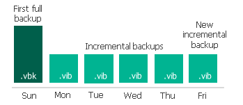
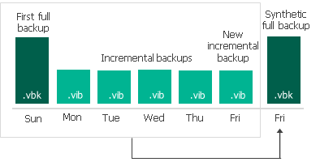
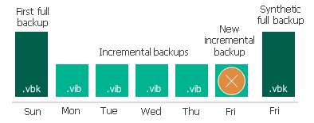

# Synthetic Full Backup

In some situations, running active full backups periodically may not be an option. Active full backups are resource-intensive and consume considerable amount of network bandwidth. As an alternative, you can create synthetic full backups that also produce VBK files and contain data of the whole VM. However, while creating synthetic full backups, Veeam Plug-in for Scale Computing HyperCore does not retrieve VM data from the cluster but processes the data that is already stored in the backup repository.

To create a synthetic full backup, Veeam Plug-in for Scale Computing HyperCore performs the following operations:

1. Veeam Plug-in for Scale Computing HyperCore creates a regular incremental backup and adds it to the backup chain.

1. Veeam Plug-in for Scale Computing HyperCore creates a new synthetic full backup using backup files that are already available in the backup chain, including the newly created incremental backup file.

1. Veeam Plug-in for Scale Computing HyperCore deletes the created incremental backup as its data is already incorporated in the synthetic full backup.

When creating a synthetic full backup, Veeam Plug-in for Scale Computing HyperCore starts a new backup chain for the VM. All further created incremental backups use the latest full backup file as a new starting point. The old full backup file from the old backup chain remains on disk until it is automatically deleted according to the retention policy.

The synthetic full backup session starts at the same time when the backup job is scheduled. For example, if you schedule the backup job to run at 12:00 AM Sunday through Friday, and schedule synthetic full backup to be created on Saturday, Veeam Plug-in for Scale Computing HyperCore will start a backup job session that will produce a synthetic full backup at 12:00 AM on Saturday.

If the backup job is not scheduled to run automatically or is disabled, Veeam Plug-in for Scale Computing HyperCore will not perform synthetic full backup. If a regular backup session and a synthetic full backup session are scheduled on the same day, Veeam Plug-in for Scale Computing HyperCore will produce a synthetic full backup — an incremental backup that should have been created by the regular backup session will not be added to the backup chain. However, if you run the backup job again on the same day manually, Veeam Plug-in for Scale Computing HyperCore will perform incremental backup in a regular manner.

