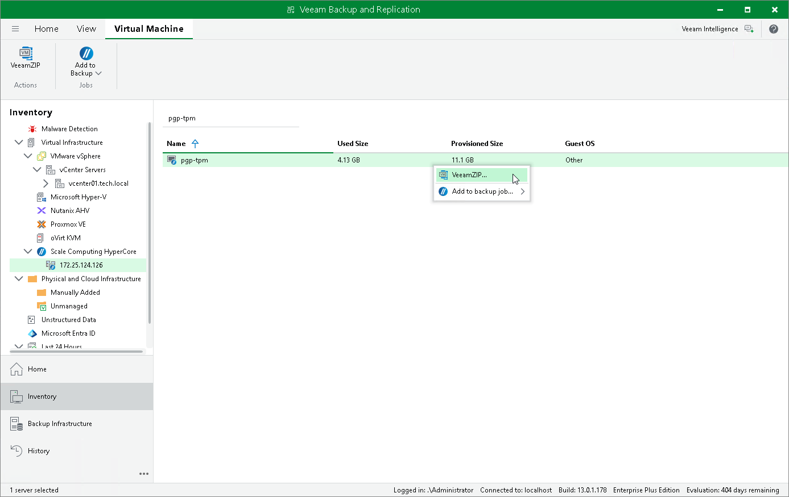

# Creating VeeamZIP Backups

You can back up one or multiple VMs without configuring backup jobs. To do that, you can leverage the VeeamZIP feature — it can be helpful, for example, if you want to create backups for VMs immediately, archive VMs before decommissioning and so on. VeeamZIP produces a full backup that acts as an independent restore point. You can store the backup in a repository added to the backup infrastructure, in a local folder on the backup server or in a network share.

|  |
| --- |
| Note |
| * You cannot store VeeamZIP backups in Veeam Cloud Connect and [HPE Cloud Bank Storage](https://helpcenter.veeam.com/docs/vbr/userguide/storeonce_supported_features.html?ver=13#cloud-bank-storage) repositories. * Retention of VeeamZIP backups is not supported. * Veeam Backup & Replication does not apply network traffic throttling rules to VeeamZIP backup sessions. For more information, see the Veeam Backup & Replication User Guide, section [Configuring Network Traffic Rules](https://helpcenter.veeam.com/docs/vbr/userguide/network_rules.html?ver=13). |

To create a VeeamZIP backup, do the following:

1. Open the Inventory view.
2. In the inventory pane, select Virtual Infrastructure > Scale Computing HyperCore.
3. In the working area, select the VM that you want to back up and click VeeamZIP on the ribbon.

Alternatively, right-click the VM and select VeeamZIP.

1. Select the destination where the VeeamZIP backup will be stored.

|  |
| --- |
| Tip |
| You cannot specify an SMB share that requires authentication as a local or shared folder. However, you can [add the SMB share to the backup infrastructure](https://helpcenter.veeam.com/docs/vbr/userguide/repo_add.html?ver=13) and specify it as backup repository. |

The created VeeamZIP backup will be displayed under the Backups > Disk (Exported) node in the Home view of the Veeam Backup & Replication console.

