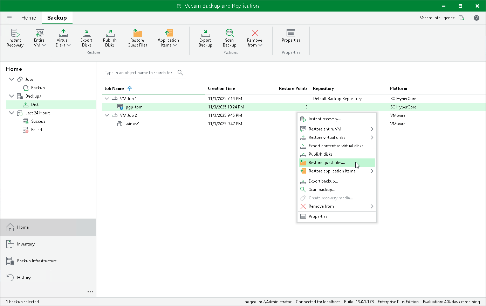

# Performing File-Level Restore

With guest OS file recovery (file-level restore), you can restore individual guest OS files and folders from VM backups created with Veeam Plug-in for Scale Computing HyperCore. When restoring files and folders, you do not need to extract the VM image to a staging location or start the VM prior to restore. For more information on VM guest OS file restore, see the Veeam Backup & Replication User Guide, section [Guest OS File Recovery](https://helpcenter.veeam.com/docs/vbr/userguide/guest_file_recovery.html?ver=13).

To restore VM guest OS files and folders, do the following:

1. Open the Home view.
2. In the inventory pane, select Backups.
3. In the working area, expand the necessary backup job, right-click the VM that contains files you want to restore and select Restore guest files.

Alternatively, you can select the VM and click Restore Guest Files on the ribbon.

1. Complete the File Level Restore wizard as described in the Veeam Backup & Replication User Guide, section [Recovering Guest OS Files Using Console](https://helpcenter.veeam.com/docs/vbr/userguide/performing_guest_restore.html?ver=13).

|  |
| --- |
| Note |
| To restore files of a VM with an operation system other than Microsoft Windows, Veeam Plug-in for Scale Computing HyperCore requires a [mount host](https://helpcenter.veeam.com/docs/vbr/userguide/guest_file_recovery.html?ver=13#mount-hosts) — a server that will be used to mount VM disks. While completing the Guest File Restore wizard, you will be able either to choose a server already added to the backup infrastructure or to specify connection settings of a new server that will be used as a mount host.  If you want to select temporary helper appliance as a mount host option, you can deploy it only on a VMware vSphere, Microsoft Hyper-V or Nutanix AHV machine.  For file-level restore to work, Veeam Plug-in for Scale Computing HyperCore must be able to obtain source VM IP address which requires guest tools to be installed on the VM. |

