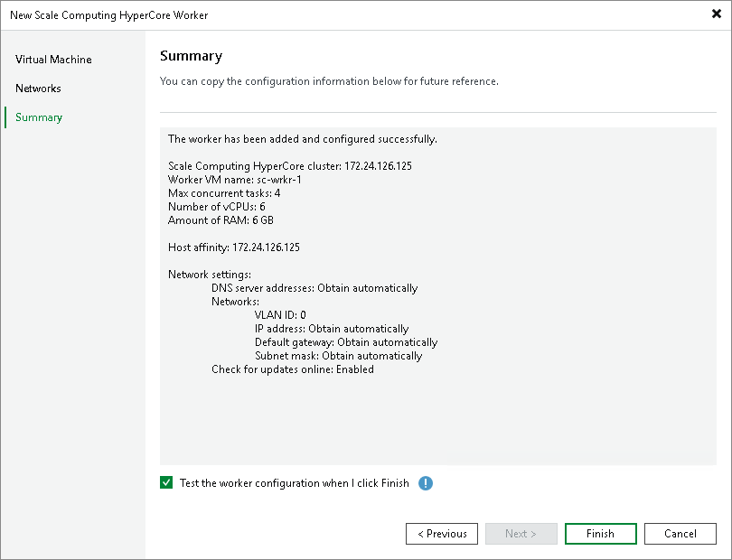

# Step 4. Finish Working with Wizard

At the Summary step of the wizard, review summary information and click Finish.

|  |
| --- |
| Tip |
| To test the worker, select the Test the worker configuration when I click Finish check box and then click Finish. |

