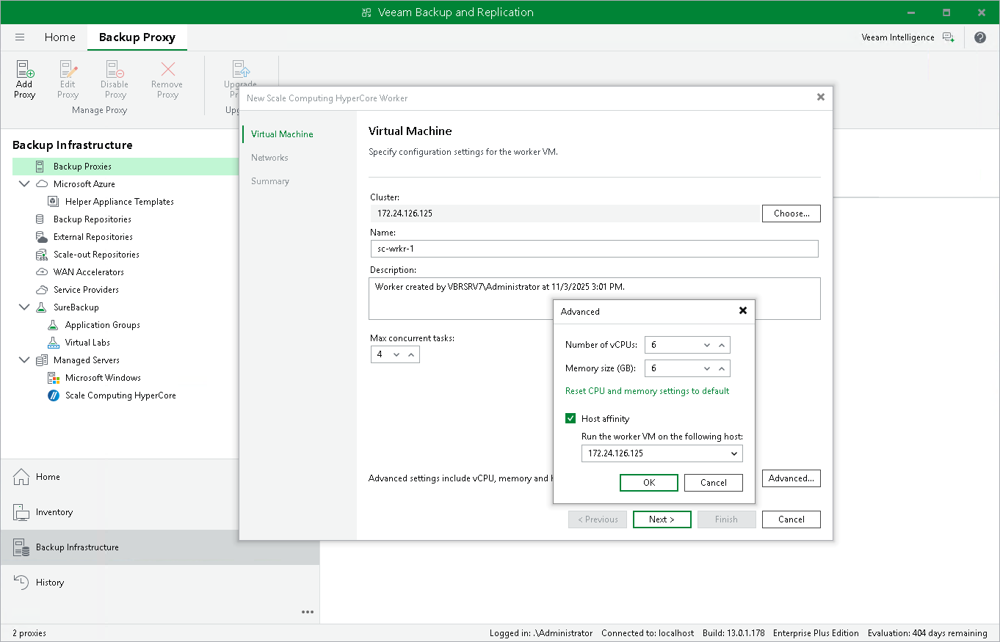

# Step 2. Specify Worker VM Settings

At the Virtual Machine step of the wizard, do the following:

1. Click Choose next to the Cluster field to specify a cluster where the worker will be launched.
2. In the Name field, specify a name for the worker. The maximum length of the name is 40 characters; the following characters are only supported: a-z, A-Z, 0-9, -.
3. In the Worker description field, provide a description for future reference. The maximum length of the description is 1024 characters.
4. In the Max concurrent tasks field, specify the number of tasks that the worker will be able to handle in parallel. If this value is exceeded, the worker will not start processing a new task until one of the currently running tasks finishes.

The default number of concurrent tasks is set to 4. When you change this value, the wizard automatically adjusts the amount of resources that will be allocated to the worker. If you want to specify the amount of resources manually as well as configure host affinity, click Advanced.

|  |
| --- |
| Note |
| When performing data protection and disaster recovery operations, Veeam Plug-in for Scale Computing HyperCore initiates a new task for each VM that is being processed. |

