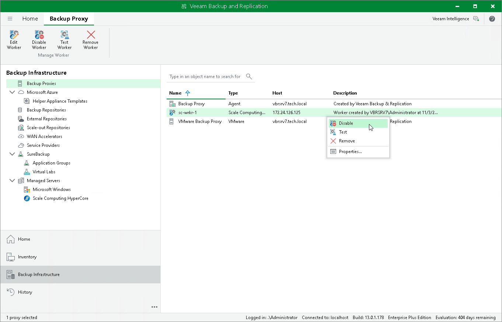

# Enabling and Disabling Workers

By default, workers are launched when jobs or restore sessions start. However, you can temporarily disable a worker — this may be helpful when you reconfigure a worker and you do not want it to be used for a backup or restore operation. You will still be able to enable the disabled worker at any time you need.

To enable or disable a worker, do the following:

1. Open the Backup Infrastructure view.
2. In the inventory pane, select Backup Proxies.
3. In the working area, select the necessary worker and click Disable Worker or Enable Worker on the ribbon.

Alternatively, right-click the worker and select Disable or Enable.

