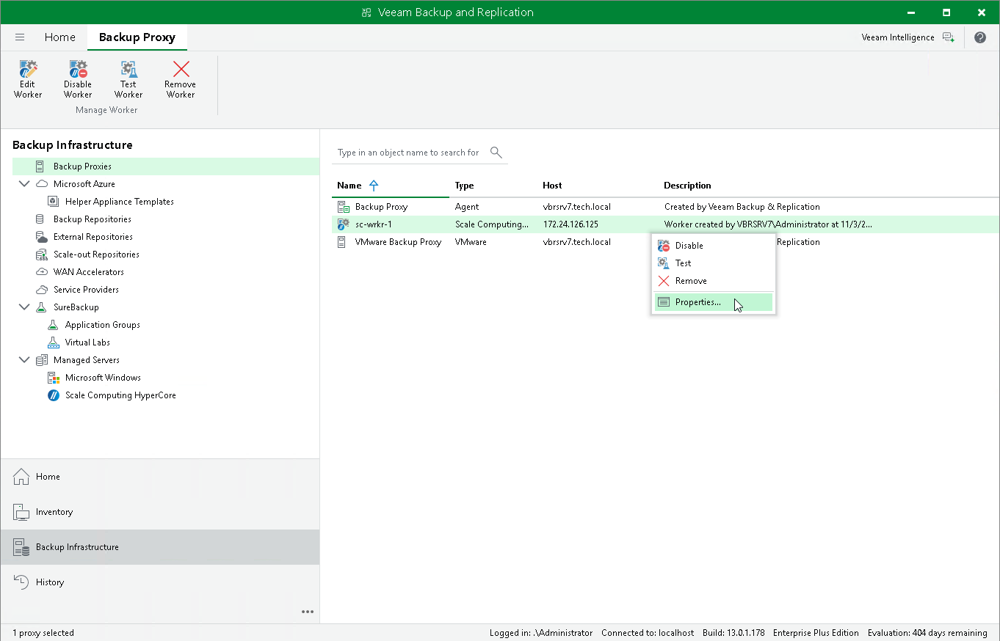

# Editing Workers

For each worker, you can modify settings specified while adding the worker to the backup infrastructure:

1. Open the Backup Infrastructure view.
2. In the inventory pane, select Backup Proxies.
3. In the working area, select the necessary worker and click Edit Worker on the ribbon.

Alternatively, right-click the worker and select Properties.

1. Complete the Edit Scale Computing HyperCore Worker wizard as described in section [Adding Workers](workers_add.md).

|  |
| --- |
| Important |
| It is not recommended that you decrease the amount of allocated resources or modify the network settings while the worker is currently transferring data. In this case, Veeam Plug-in for Scale Computing HyperCore will terminate the related operations, power off the worker and update the settings immediately. |

