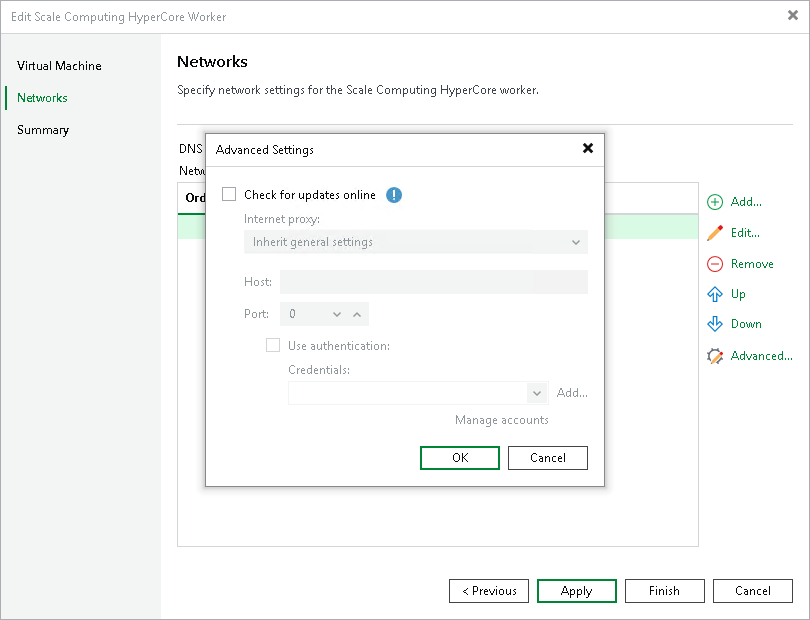

# Disabling Automatic Worker Updates

When launching a worker for a backup or restore operation, Veeam Plug-in for Scale Computing HyperCore automatically downloads updates from Veeam repositories and installs them on the worker. If the worker is not connected to the internet, you can instruct Veeam Plug-in for Scale Computing HyperCore to [use an HTTP proxy](workers_add_network.md) that will provide access to the necessary repositories.

If a worker does not have access to the internet and no HTTP proxy is configured for the worker, you can disable automatic updates to avoid connection failures and eliminate session warnings:

1. Open the Backup Infrastructure view.
2. In the inventory pane, select Backup Proxies.
3. In the working area, select the necessary worker and click Edit Worker on the ribbon.

Alternatively, right-click the worker and select Properties.

1. At the Networks step of the Edit Scale Computing HyperCore Worker wizard, click Advanced and clear the Check for updates online check box. Then, click Finish to save changes made to the worker settings.

   

